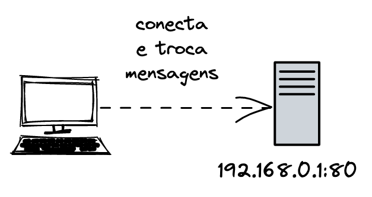

# Programando um echo server

Quando falamos de criar um programa cliente e servidor, umas das primeiras aplicações que vem à cabeça é um _echo server_. Esta aplicação permite que um cliente mande uma mensagem ao servidor e este servidor responda com a mesma mensagem enviada - por isso _eco_.

Como essa relação cliente e servidor impacta nosso dia-a-dia? O que é um servidor? O que é um cliente?

## Servidor

Um servidor é um programa de computador que providencia e recebe informações de clientes, ou outros servidores. A internet é cheia de servidores, todos eles provendo soluções distintas. Para que um cliente, por exemplo um navegador, possa conectar em um servidor, o cliente precisa saber o IP e a porta na qual aquele servidor está escutando. Nem todo servidor precisa estar em uma rede pública. Eles podem estar em redes privadas ou até mesmo na sua própria rede local, usando como endereço o famoso _localhost_. IP, porta e protocolo de comunicação são informações essenciais para que um cliente ou servidor precisam para se comunicar com servidores.

## Cliente

Clientes são ferramentas usadas para conectar e trocar informações com os serviços oferecidos por servidores. Um cliente pode ser tanto um aplicativo, um navegador, ou a ferramenta _curl_. Ambas ferramentas sabem como conectar em uma página web, por exemplo, seguindo o protocolo HTTP.

## Programando nosso servidor

Vamos começar a ter nossos primeiros exemplos de código. Certifique-se de que você tem o _go_ instalado na sua máquina, que você sabe como escrever e executar simples programas em _go_.

```go
package main

import (
    "io"
    "log"
    "net"
)

func main() {
    addr := "localhost:8080"
    server, err := net.Listen("tcp", addr)
    if err != nil {
        log.Fatalln(err)
    }
    defer server.Close()

    log.Printf("server running on: %s", addr)

    for {
        conn, err := server.Accept()
        if err != nil {
            log.Printf("failed accepting a new connection: %s", err.Error())
            continue
        }
        log.Println("client connected")

        go func(conn net.Conn) {
            defer conn.Close()

            io.Copy(conn, conn)
        }(conn)
    }
}
```

Salve esse código em um arquivo com o nome _main.go_. Para executar o programa acima, podemos usar o comando _run_:

```console
go run main.go
```

Para testar esse programa, podemos usar ferramentas como _telnet_ ou _netcat_.
Com ambas ferramentas é possível conectar em um IP e uma porta, iniciando a comunicação cliente e servidor, enviando e recebendo dados.

```console
nc localhost 8080
```

Perceba que ao executar o programa _netcat_ você entrou em um estado que espera uma entrada. Podemos digitar algum texto e pressionar enter. A mensagem vai ser enviada para o servidor, que responderá de volta com a mesma mensagem enviada. Uma possível interação com o server se parece como seguinte:

```console
$ nc localhost 8080
olá mundo!
olá mundo!
vamos construir um chat?
vamos construir um chat?
```

Agora que já criamos nosso primeiro programa envolvendo protocolos de comunicação, vamos entender cada detalhe do código escrito.

```go
server, err := net.Listen("tcp", addr)
```

Você já ouviu alguém falar a frase "o servidor está escutando"?



Um servidor escuta em uma porta, e isso significa que ele está pronto para receber conexões nela. Quando um cliente faz uma requisição para iniciar uma conversa com aquele servidor, uma conexão é aberta. O servidor fica ativamente esperando requisições até que o programa ou o servidor pare de responder.

> Nos próximos capítulos explicaremos com mais detalhes como essa comunicação com sockets funcionam, dando exemplos de códigos e explicando.

Essa linha `defer server.Close()` é relacionada diretamente com a feature _defer_  do go, que uma garante a execução da função em questão, logo antes de retornar.

A próxima parte do código tem um loop. O loop é necessário para que entremos em um estado que nos permite continuar aceitando conexões, quase como se o servidor fosse recepcionista de um hotel, que tem o trabalho de receber hóspedes e direcionar para seus quartos.

A funcão `Accept` bloqueia a execução do código esperando novas conexões. Mas se o programa é bloqueado, como um servidor consegue gerenciar tantas conexões ao mesmo tempo?

O comportamento que é bloqueante é apenas a espera de uma nova conexão, não o que será realizado com essa conexão. Para que cada conexão seja tratada de forma concorrente, usamos uma corrotina em go, as goroutines, para gerenciar cada conexão separadamente.

```go
go func(conn net.Conn) {
    defer conn.Close()
    io.Copy(conn, conn)
}(conn)
```

O código acima é importante por dois motivos: lidar com a conexão em uma corrotina e escrever na conexão a própria mensagem enviada, proporcionando o comportamento de _eco_.

Em go, a palavra reservada `go` executa a função (anônima ou não) seguinte em uma corrotina.

E a chamada da função `Copy` do pacote `io` tem o seguinte comportamente: copiar os bytes da origem até o destino até que [EOF](https://pt.wikipedia.org/wiki/EOF) aconteça na origem ou algum erro em ambas as pontas da conexão. Retorna o número de bytes copiados e um erro que pode ser `nil` caso nenhum problema tenha acontecido.

Observe que copiamos da origem `conn` até o destino `conn`, que significa que estamos lendo o input da origem e escrevendo na origem da conexão.
